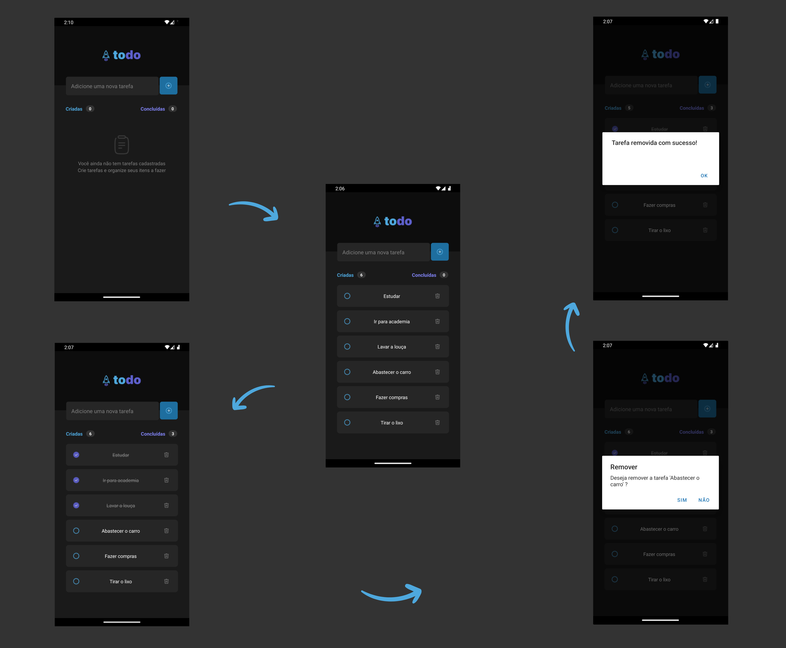

# Controle de Tarefas - React Native

Este projeto é uma aplicação de to-do list desenvolvida com React Native, seguindo um desafio que visa reforçar conceitos fundamentais da biblioteca.

## Funcionalidades
A aplicação possui as seguintes funcionalidades:

- Adicionar uma nova tarefa: Permite que o usuário insira uma nova tarefa na lista.
- Marcar e desmarcar uma tarefa como concluída: O usuário pode marcar uma tarefa como concluída ou desmarcá-la.
- Remover uma tarefa da listagem: Permite que o usuário remova tarefas da lista.
- Mostrar o progresso de conclusão das tarefas: Exibe o progresso de conclusão das tarefas com base na quantidade de tarefas concluídas.

## Tecnologias Utilizadas
- React Native: Biblioteca para desenvolvimento de aplicativos móveis.
- React: Biblioteca JavaScript para a criação de interfaces de usuário.
- Expo: Ferramenta e plataforma para React Native.

## Screenshots do App

